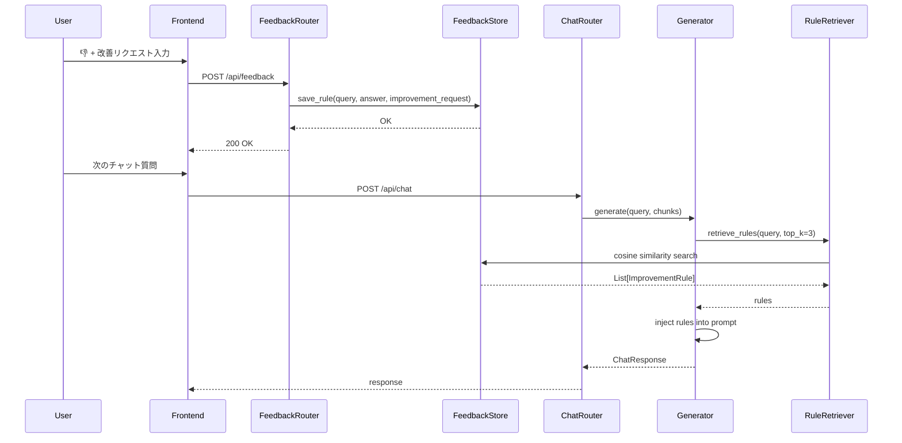
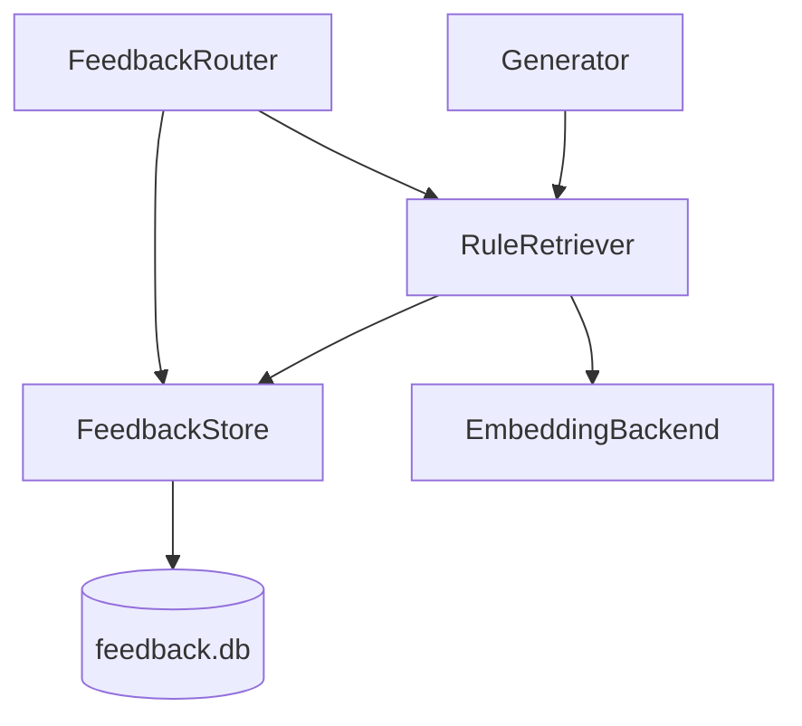

# 設計書: フィードバック駆動型自己改善機能

## Overview

本機能は、Orbチャットシステムにユーザーフィードバックループを追加し、回答品質を継続的に自己改善する仕組みを提供する。

ユーザーが👎フィードバックと改善リクエストを送信すると、そのリクエストは「改善ルール」としてSQLiteデータベースに保存される。次回以降のチャットでは、`RuleRetriever`がクエリに関連するルールをコサイン類似度でRAG検索し、`Generator`がプロンプトの先頭に動的注入することで、LLMの回答品質を向上させる。



## Architecture

### コンポーネント構成

```
backend/
├── feedback/
│   ├── __init__.py
│   ├── store.py          # FeedbackStore: SQLite永続化
│   └── retriever.py      # RuleRetriever: コサイン類似度検索
├── routers/
│   └── feedback.py       # POST /api/feedback, GET/DELETE /api/feedback/rules
├── generation/
│   └── generator.py      # 既存: RuleRetriever注入・プロンプト拡張
└── models.py             # 既存: FeedbackRequest, ImprovementRule モデル追加
```

### 依存関係



### 既存コンポーネントへの変更

| コンポーネント | 変更内容 |
|---|---|
| `Generator.__init__` | `rule_retriever: Optional[RuleRetriever]` 引数を追加 |
| `Generator.generate` | `RuleRetriever.retrieve_rules()` 呼び出しとプロンプト注入を追加 |
| `Generator._build_prompt` | IMPROVEMENT RULES セクションの挿入ロジックを追加 |
| `main.py` lifespan | `FeedbackStore` と `RuleRetriever` の初期化を追加 |
| `routers/dependencies.py` | `get_feedback_store`, `get_rule_retriever` 依存関数を追加 |
| `models.py` | `FeedbackRequest`, `ImprovementRule`, `FeedbackRuleResponse` を追加 |

## Components and Interfaces

### FeedbackStore

```python
class FeedbackStore:
    def __init__(self, db_path: str = "backend/feedback.db"):
        """SQLiteデータベースを初期化し、テーブルを作成する"""

    def save_rule(
        self,
        query_text: str,
        answer_text: str,
        improvement_request: str,
        embedding: List[float]
    ) -> int:
        """改善ルールを保存し、生成されたIDを返す"""

    def log_feedback(
        self,
        message_id: str,
        query_text: str,
        feedback_type: str  # "positive" | "negative"
    ) -> None:
        """フィードバックログを記録する"""

    def get_all_rules(self) -> List[ImprovementRule]:
        """全改善ルールを取得する"""

    def delete_rule(self, rule_id: int) -> bool:
        """指定IDのルールを削除する。存在しない場合はFalseを返す"""

    def get_rules_with_embeddings(self) -> List[Tuple[ImprovementRule, List[float]]]:
        """コサイン類似度計算用にルールとEmbeddingを取得する"""
```

### RuleRetriever

```python
class RuleRetriever:
    def __init__(self, store: FeedbackStore, embedding_backend: EmbeddingBackend):
        pass

    def retrieve_rules(self, query: str, top_k: int = 3) -> List[ImprovementRule]:
        """
        クエリに関連する改善ルールをコサイン類似度で取得する。
        - top_k <= 0 の場合は空リストを返す
        - ストアが空の場合は空リストを返す
        - 失敗時は空リストを返す（例外を伝播させない）
        """
```

### Generator（変更箇所）

```python
class Generator:
    def __init__(
        self,
        llm_backend: LLMBackend,
        rule_retriever: Optional[RuleRetriever] = None  # 追加
    ):
        pass

    def _build_prompt(
        self,
        query: str,
        chunks: List[Chunk],
        history: Optional[List[ChatTurn]],
        improvement_rules: Optional[List[ImprovementRule]] = None  # 追加
    ) -> str:
        """
        プロンプト構築。improvement_rules が存在する場合、
        CONTEXT セクションの前に IMPROVEMENT RULES セクションを挿入する。
        """

    def _estimate_tokens(self, text: str) -> int:
        """文字数ベースのトークン推定（1トークン ≈ 2文字）"""

    def _trim_rules_to_fit(
        self,
        rules: List[ImprovementRule],
        base_prompt: str,
        max_tokens: int = 4096
    ) -> List[ImprovementRule]:
        """トークン上限に収まるようにルール件数を削減する"""
```

### FeedbackRouter

```
POST /api/feedback
  Body: FeedbackRequest
  Response: {"status": "ok"}

GET /api/feedback/rules
  Response: List[FeedbackRuleResponse]

DELETE /api/feedback/rules/{rule_id}
  Response: {"status": "deleted"} | 404
```

## Data Models

### 新規モデル（`backend/models.py` に追加）

```python
from typing import Literal

class FeedbackRequest(BaseModel):
    """POST /api/feedback のリクエストボディ"""
    message_id: str = Field(..., description="チャットメッセージID")
    query: str = Field(..., description="ユーザーのクエリ")
    answer: str = Field(..., description="アシスタントの回答")
    feedback_type: Literal["positive", "negative"] = Field(..., description="フィードバック種別")
    improvement_request: Optional[str] = Field(None, description="改善リクエスト（negativeの場合）")


class ImprovementRule(BaseModel):
    """改善ルールのデータモデル"""
    id: Optional[int] = Field(None, description="DB上のID")
    query_text: str = Field(..., description="元のクエリテキスト")
    answer_text: str = Field(..., description="元の回答テキスト")
    improvement_request: str = Field(..., description="改善リクエスト内容")
    created_at: Optional[datetime] = Field(None, description="作成日時")


class FeedbackRuleResponse(BaseModel):
    """GET /api/feedback/rules のレスポンス要素"""
    id: int
    query_text: str
    improvement_request: str
    created_at: datetime
```

### SQLiteスキーマ

```sql
-- 改善ルールテーブル
CREATE TABLE IF NOT EXISTS improvement_rules (
    id               INTEGER PRIMARY KEY AUTOINCREMENT,
    query_text       TEXT    NOT NULL,
    answer_text      TEXT    NOT NULL,
    improvement_request TEXT NOT NULL,
    rule_embedding   BLOB    NOT NULL,  -- pickle.dumps(List[float])
    created_at       DATETIME DEFAULT CURRENT_TIMESTAMP
);

-- フィードバックログテーブル
CREATE TABLE IF NOT EXISTS feedback_logs (
    id            INTEGER PRIMARY KEY AUTOINCREMENT,
    message_id    TEXT    NOT NULL,
    query_text    TEXT    NOT NULL,
    feedback_type TEXT    NOT NULL,  -- "positive" | "negative"
    created_at    DATETIME DEFAULT CURRENT_TIMESTAMP
);
```

### プロンプト注入フォーマット

```
{system_prompt}

--- IMPROVEMENT RULES ---
以下は過去のフィードバックに基づく改善指示です。回答時に参考にしてください:
- {improvement_request_1}
- {improvement_request_2}
- {improvement_request_3}

--- CONTEXT ---
Chunk 1:
...
```

## Correctness Properties

*A property is a characteristic or behavior that should hold true across all valid executions of a system — essentially, a formal statement about what the system should do. Properties serve as the bridge between human-readable specifications and machine-verifiable correctness guarantees.*

### Property 1: 改善ルール保存ラウンドトリップ

*For any* 有効な `query_text`、`answer_text`、`improvement_request`、および Embedding ベクトルの組み合わせに対して、`FeedbackStore.save_rule()` で保存した後に `get_rules_with_embeddings()` で取得すると、保存したすべてのフィールド（テキスト3フィールドと Embedding ベクトル）が完全に一致するルールが含まれている。

**Validates: Requirements 3.3, 3.4**

### Property 2: FeedbackStore 初期化の冪等性

*For any* 回数だけ `FeedbackStore` を初期化しても、エラーが発生せず、`improvement_rules` テーブルと `feedback_logs` テーブルが正しく存在する。

**Validates: Requirements 3.5, 3.6**

### Property 3: ルール取得の順序と件数制約

*For any* クエリと任意の件数の改善ルールが存在する場合、`retrieve_rules(query, top_k=k)` が返すリストは (a) 長さが `min(k, ルール総数)` 以下であり、(b) クエリとのコサイン類似度の降順に並んでいる。

**Validates: Requirements 4.2, 5.4**

### Property 4: プロンプトへのルール注入フォーマット

*For any* 1件以上の改善ルールリストに対して、`Generator._build_prompt()` が生成するプロンプトは「IMPROVEMENT RULES」セクションを含み、各ルールの `improvement_request` が「- 」で始まる行として含まれている。

**Validates: Requirements 5.2, 5.5**

### Property 5: トークン上限の遵守

*For any* 改善ルールのリストとベースプロンプトに対して、`_trim_rules_to_fit()` が返すルールリストを注入したプロンプトの推定トークン数（文字数 / 2）は、設定された上限（4096）を超えない。

**Validates: Requirements 6.1, 6.2**

### Property 6: ルール削除ラウンドトリップ

*For any* 保存された改善ルールに対して、`DELETE /api/feedback/rules/{id}` を呼び出した後、`GET /api/feedback/rules` のレスポンスにそのルールが含まれず、同じ ID への再 DELETE は HTTP 404 を返す。

**Validates: Requirements 7.2, 7.4, 7.5**

## Error Handling

| シナリオ | 処理方針 |
|---|---|
| `RuleRetriever` の取得失敗 | 例外をキャッチし、空リストを返してチャットを継続（要件5.6） |
| `FeedbackStore` への書き込み失敗 | HTTP 500 を返す |
| 存在しない `rule_id` への DELETE | HTTP 404 を返す（要件7.5） |
| `feedback_type` が不正値 | Pydantic バリデーションにより HTTP 422 を返す（要件2.7） |
| `query` または `feedback_type` が欠落 | Pydantic バリデーションにより HTTP 422 を返す（要件2.6） |
| Embedding 生成失敗（ルール保存時） | HTTP 500 を返す |
| トークン上限超過 | ルール件数を段階的に削減し、0件でも超過する場合は既存チャンク削減ロジックを適用（要件6.3） |

## Testing Strategy

### ユニットテスト

- `FeedbackStore`: テーブル作成、ルール保存・取得・削除、ログ記録
- `RuleRetriever`: コサイン類似度計算、top_k 制限、空ストア処理、エラー時の空リスト返却
- `Generator._build_prompt`: ルールあり/なしのプロンプト構造検証
- `Generator._trim_rules_to_fit`: トークン上限遵守の検証
- `FeedbackRouter`: 各エンドポイントのリクエスト/レスポンス検証

### プロパティベーステスト（hypothesis を使用）

各プロパティテストは最低100回のイテレーションで実行する。

- **Feature: feedback-driven-improvement, Property 1**: ランダムなテキストトリプルで保存→取得ラウンドトリップを検証
- **Feature: feedback-driven-improvement, Property 2**: ランダムなルールセットでコサイン類似度降順を検証
- **Feature: feedback-driven-improvement, Property 3**: ランダムな top_k とルール数で上限遵守を検証
- **Feature: feedback-driven-improvement, Property 4**: 空ストアでの安全な取得を検証
- **Feature: feedback-driven-improvement, Property 5**: ランダムなルールリストでトークン上限遵守を検証
- **Feature: feedback-driven-improvement, Property 6**: ランダムなルールIDで削除冪等性を検証

### 統合テスト

- `POST /api/feedback` → `GET /api/feedback/rules` の一連のフロー
- フィードバック保存後のチャットでルールが注入されることの確認
- `DELETE /api/feedback/rules/{id}` 後にルールが取得されないことの確認
