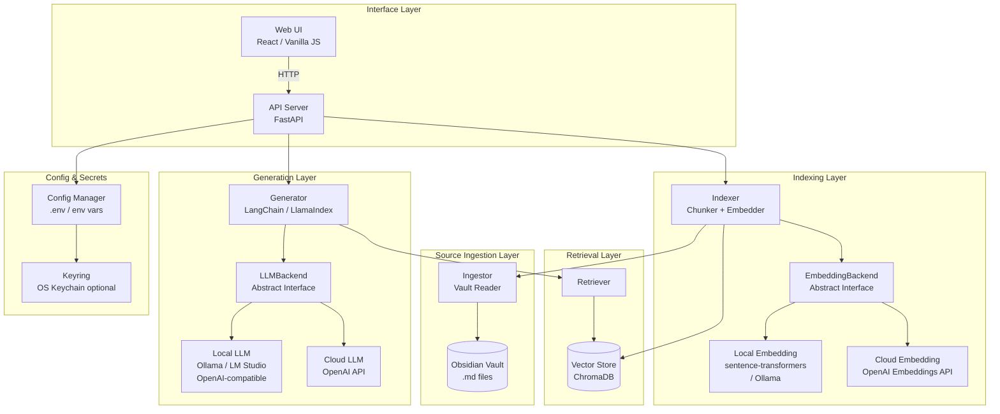
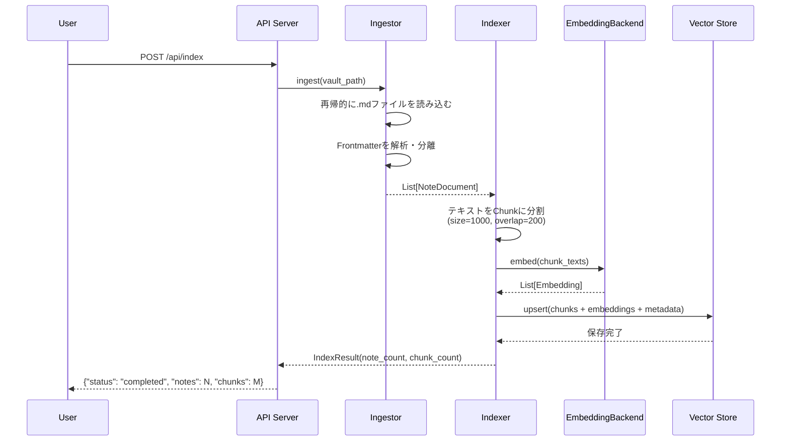
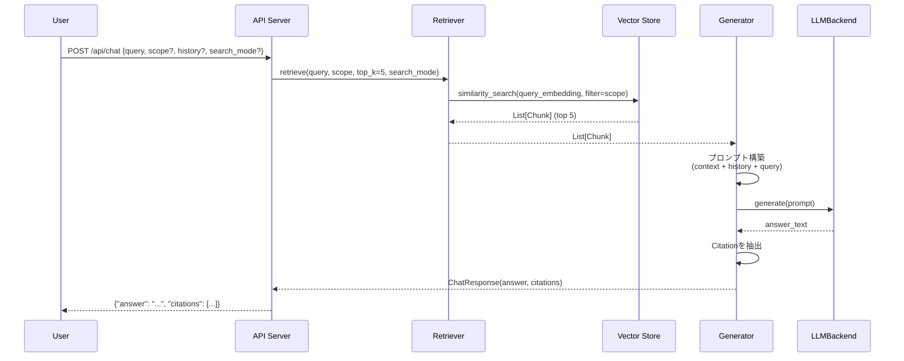

# Design Document: Orb

## 概要

本システムは、ホームサーバー上で動作するプライベートRAGチャットアプリケーションである。ObsidianのVault（Markdownファイル群）をインジェスト・インデックス化し、ユーザーが自然言語でVaultの内容に問い合わせできるようにする。

**設計原則:**

- プライバシーファースト・ローカルファースト: Vaultデータはホームサーバーのネットワーク境界内に留まる
- ソロ開発者MVP: 不必要なエンタープライズ複雑性を排除し、現実的な実装規模を維持する
- 層の分離: Source Ingestion層をIndexing・Retrieval・Generation・Interface層から明確に分離し、将来の他データソース対応を容易にする
- 抽象化インターフェース: LLMおよびEmbeddingバックエンドを抽象化し、ローカル/クラウドの切り替えを設定のみで実現する
- 将来拡張性: MCP統合・Tailscaleアクセスへの拡張を見据えた設計

---

## アーキテクチャ

### システム全体構成図



### データフロー

#### インジェスト・インデックス化フロー



#### チャットフロー



---

## コンポーネントと主要インターフェース

### Source Ingestion Layer: `Ingestor`

**責務:** Vault内の`.md`ファイルを再帰的に読み込み、Frontmatterとボディを分離してNoteDocumentを生成する。Indexerとは独立したインターフェースを持ち、将来の他データソース（Notion、ローカルPDF等）への拡張を可能にする。

```python
class BaseIngestor(ABC):
    @abstractmethod
    def ingest(self, source_path: str) -> IngestResult:
        """データソースを読み込み、NoteDocumentのリストを返す"""
        ...

class ObsidianIngestor(BaseIngestor):
    def ingest(self, vault_path: str) -> IngestResult:
        """Vault配下の.mdファイルを再帰的に読み込む"""
        ...
```

### Indexing Layer: `Indexer`

**責務:** NoteDocumentをChunkに分割し、EmbeddingBackendを使用してベクトルを生成し、Vector Storeへ永続化する。

```python
class Indexer:
    def __init__(self, embedding_backend: EmbeddingBackend, vector_store: VectorStore):
        ...

    def index(self, ingest_result: IngestResult) -> IndexResult:
        """NoteDocumentをチャンク分割・Embedding生成・保存する"""
        ...
```

### Retrieval Layer: `Retriever`

**責務:** 上流で確定した検索計画に従って、Vector Storeから関連Chunkを検索し、命題Chunkと通常Chunkを統合・再順位付けする。`Retriever` 自身はUI由来の検索モードやスコープを推測するのではなく、確定済みの plan を実行する層として振る舞う。

### Query Parsing Layer: `QueryParser`

**責務:** 生のユーザー入力、およびWeb UIから渡された検索モード・スコープを決定論的に解釈し、検索条件を分離する。

```python
class QueryParser:
    def parse(
        self,
        raw_text: str,
        ui_search_mode: SearchMode = SearchMode.AUTO,
        ui_scope: Optional[Scope] = None,
    ) -> ParsedQuery:
        """/mode、#tag、@folder と自然文本文を分離する"""
        ...
```

### Query Planning Layer: `QueryPlanner`

**責務:** `ParsedQuery` を受け取り、日付正規化・意図分類・検索戦略選択を行い、`RetrievalPlan` を生成する。

```python
class QueryPlanner:
    def build_plan(self, parsed_query: ParsedQuery, top_k: int = 5) -> RetrievalPlan:
        """検索モード、スコープ、意図分類を元に実行計画を返す"""
        ...
```

```python
class Retriever:
    def __init__(self, embedding_backend: EmbeddingBackend, vector_store: VectorStore):
        ...

    def retrieve(self, plan: RetrievalPlan) -> List[Chunk]:
        """検索計画に従って関連Chunkを返す"""
        ...
```

#### 検索モード戦略

- **Auto:** まず日付意図・日記意図・日記型時系列意図を判定し、その後に fact/context 判定を行う。日記意図がある場合は `Diary` 相当の戦略へルーティングする
- **Diary:** 日付正規化と日記ファイル名ベース検索を第一候補としつつ、日記スコープ内で Proposition Chunk と通常Chunkを統合する
- **General:** 汎用ノートを対象に検索を行い、fact query では proposition-first、context query では regular-first、曖昧な場合は balanced hybrid を用いる

#### Retrieval 実行フロー

```text
Chat Request
├─ QueryParser.parse()
│  ├─ /auto, /diary, /general を抽出
│  ├─ #tag, @folder を抽出
│  ├─ UI指定の search_mode / scope と統合
│  └─ ParsedQuery を生成
├─ QueryPlanner.build_plan()
│  ├─ 日付正規化
│  ├─ date / diary / temporal / fact / context の意図分類
│  └─ RetrievalPlan を生成
└─ Retriever.retrieve(plan)
   ├─ Diary plan を実行
   ├─ General plan を実行
   └─ Auto plan を Diary / General へルーティング
```

#### メタデータ活用型検索戦略

- 時系列意図を含むクエリでは、まず主対象キーワードを抽出し、そのキーワードに対して広めの意味検索を実行する
- 広めに取得したChunk群に対して、`last_modified`、Frontmatter内の日付、`source_path`、`tags` を使って Python 側で再順位付けする
- 「初めて」「最初」のようなクエリでは古い日時を優先し、「最後」「直近」のようなクエリでは新しい日時を優先する
- フォルダスコープやタグスコープが指定されている場合は、その制約を維持したうえで時系列分析を適用する
- 根拠となる時系列情報が不十分な場合は、断定的な分析結果を返さず通常の意味検索結果へフォールバックする
- 日記意図を伴う時系列クエリでは、Diary scope 内の Proposition Chunk と通常Chunkを統合し、日付メタデータとファイル名一致で再順位付けする

#### note-centric ranking

- 検索結果は `source_path` 単位で集約し、同一ノート由来の命題Chunkと通常Chunkを関連付ける
- `date exact match`、`filename/title match`、`diary path match`、`proposition + regular の両立` を主要な加点要素とする
- Diary モードでは proposition を入口、regular chunk を補足本文として扱えるようにする

#### `Retriever` の内部ヘルパー責務

- `_is_temporal_query(query)`: 時系列意図を持つクエリかを判定する
- `_extract_main_keyword(query)`: 分析対象となる主キーワードを抽出する
- `_sort_chunks_by_date(chunks, ascending)`: メタデータの日付に基づいてChunkを整列する
- `_find_earliest_occurrence(chunks, keyword)`: 最初の出現候補を特定する
- `_analyze_keyword_frequency(chunks, keyword)`: キーワードの出現頻度と集中期間を分析する
- `_expand_query_with_llm(query)`: LLMを使ってクエリを関連語・具体語に拡張する（Query Expansion）
- `_merge_note_hits(proposition_chunks, regular_chunks)`: note 単位で結果を集約する
- `_rank_note_hits(note_hits, plan)`: 検索計画に基づいて note 単位で再順位付けする
- `_retrieve_proposition_chunks(query, scope, top_k)`: 命題コレクションから検索する
- `_retrieve_regular_chunks(query, scope, top_k)`: 通常コレクションから検索する

#### Query Expansion（クエリ拡張）

`QueryPlanner` または `Retriever` はオプションで `LLMBackend` を受け取り、必要に応じてクエリ拡張を行う。

**動作フロー:**

```
クエリ: 「最後にアルコールを飲んだのはいつ」
    ↓ LLMに関連語を列挙させる
拡張語: 「ビール 日本酒 ワイン 焼酎 お酒 飲んだ 飲酒」
    ↓ 元クエリ + 拡張語を結合してEmbedding
ベクトル検索: 「最後にアルコールを飲んだのはいつ ビール 日本酒 ワイン...」
    ↓ さらに拡張語でキーワードスキャン
キーワードスキャン: 「ビール」「日本酒」「ワイン」を含むChunkを全件スキャン
    ↓ マージして日付降順ソート
結果: 「ビール」を含む最新の日記がヒット
```

**HyDEとの違い:**

| | HyDE（Hypothetical Document Embeddings） | Query Expansion（本実装） |
|---|---|---|
| LLMの出力 | 仮想的な文書（文章） | 関連する具体的な単語リスト |
| 検索方法 | 仮想文書のベクトルで検索 | 拡張クエリのベクトル検索 + キーワードスキャン |
| 効果 | 文体・文脈の類似性を活用 | 同義語・関連語の網羅的なヒット |

**実装上の注意:**

- LLMバックエンドが未設定の場合は元のクエリをそのまま使用（フォールバック）
- LLM呼び出しが失敗した場合も元のクエリにフォールバック（エラーを伝播させない）
- クエリ拡張は `RetrievalPlan` の構築時または検索直前に適用し、上流で確定した検索モード・スコープを上書きしない

### Generation Layer: `Generator`

**責務:** 取得したChunkと会話履歴をコンテキストとしてLLMに渡し、回答とCitationを生成する。

- `Generator` はプレーンテキスト回答に加えて、回答要約・補足・根拠を分離した構造化出力を生成できるようにする
- 構造化出力は API レスポンスで返し、Web UI 側で HTML セクションに描画する

```python
class Generator:
    def __init__(self, llm_backend: LLMBackend):
        ...

    def generate(
        self,
        query: str,
        chunks: List[Chunk],
        history: List[ChatTurn]
    ) -> ChatResponse:
        """コンテキストと履歴を使って回答を生成する"""
        ...
```

### LLMBackend 抽象インターフェース

```python
class LLMBackend(ABC):
    @abstractmethod
    def generate(self, prompt: str) -> str:
        """プロンプトを受け取り、テキスト回答を返す"""
        ...

class LocalLLMBackend(LLMBackend):
    """OpenAI互換ローカルAPIサーバー（Ollama、LM Studio等）"""
    def __init__(self, base_url: str, model: str):
        ...

class OpenAILLMBackend(LLMBackend):
    """OpenAI互換クラウドAPI"""
    def __init__(self, api_key: str, model: str):
        ...
```

### EmbeddingBackend 抽象インターフェース

```python
class EmbeddingBackend(ABC):
    @abstractmethod
    def embed(self, texts: List[str]) -> List[List[float]]:
        """テキストのリストをEmbeddingベクトルのリストに変換する"""
        ...

class LocalEmbeddingBackend(EmbeddingBackend):
    """sentence-transformers またはOllama embeddings"""
    def __init__(self, model_name: str):
        ...

class OpenAIEmbeddingBackend(EmbeddingBackend):
    """OpenAI Embeddings API"""
    def __init__(self, api_key: str, model: str):
        ...
```

### Interface Layer: `API Server` (FastAPI)

**責務:** HTTP APIエンドポイントを提供し、各層を統合する。Web UIの静的ファイルを配信する。

### Interface Layer: `Web UI`

**責務:** チャット画面・設定画面・インデックス化操作UIをブラウザに提供する。軽量なReactまたはVanilla JS + HTMLで実装する。

---

## データモデル

### `NoteDocument`

Ingestorが生成するノートの表現。

```python
@dataclass
class NoteDocument:
    file_path: str          # Vaultルートからの相対パス (例: "daily/2024-01-01.md")
    title: str              # Frontmatterのtitle、なければファイル名
    body: str               # Frontmatterを除いた本文テキスト
    tags: List[str]         # Frontmatterのtags
    frontmatter: Dict[str, Any]  # Frontmatter全体のキーと値
    last_modified: datetime # ファイルの最終更新日時
```

### `Chunk`

IndexerがNoteDocumentから生成するチャンク。Vector Storeに保存される単位。

```python
@dataclass
class Chunk:
    chunk_id: str           # 一意なID (例: "{file_path}::{chunk_index}")
    text: str               # チャンクのテキスト
    source_path: str        # 元のNoteのファイルパス
    title: str              # 元のNoteのタイトル
    tags: List[str]         # 元のNoteのタグ
    frontmatter: Dict[str, Any]  # 元のNoteのFrontmatter
    last_modified: datetime # 元のNoteの最終更新日時
    chunk_index: int        # Note内でのチャンク番号
```

### `Scope`

検索対象を絞り込む条件。

```python
@dataclass
class Scope:
    folder: Optional[str] = None  # フォルダパス (例: "daily/")
    tags: Optional[List[str]] = None  # タグリスト (例: ["journal", "work"])
```

### `SearchMode`

チャットごとの検索戦略を表す列挙型。

```python
class SearchMode(str, Enum):
    AUTO = "auto"
    DIARY = "diary"
    GENERAL = "general"
```

### `ChatRequest`

`/api/chat`エンドポイントへのリクエストボディ。

```python
class ChatRequest(BaseModel):
    query: str                          # ユーザーの質問（必須）
    scope: Optional[Scope] = None       # 検索スコープ（任意）
    history: Optional[List[ChatTurn]] = None  # 会話履歴（任意、最大5ターン）
    search_mode: SearchMode = SearchMode.AUTO  # 検索モード（省略時は auto）
```

### `ChatTurn`

会話履歴の1ターン。

```python
class ChatTurn(BaseModel):
    role: Literal["user", "assistant"]
    content: str
```

### `Citation`

回答の根拠となったNoteの引用情報。

```python
class Citation(BaseModel):
    file_path: str    # NoteのVaultルートからの相対パス
    title: str        # Noteのタイトル
    snippet: str      # 関連するテキストスニペット
```

### `ChatResponse`

`/api/chat`エンドポイントのレスポンスボディ。

```python
class ChatResponse(BaseModel):
    answer: str                  # LLMが生成した回答テキスト
    citations: List[Citation]    # 根拠となったNoteの引用リスト
```

### `IngestResult`

Ingestorの処理結果。

```python
@dataclass
class IngestResult:
    notes: List[NoteDocument]
    total_count: int
    skipped_count: int
    errors: List[Dict[str, str]]  # {"path": ..., "reason": ...}
```

### `IndexResult`

Indexerの処理結果。

```python
@dataclass
class IndexResult:
    note_count: int
    chunk_count: int
```

---

## Vector Storeスキーマ（ChromaDB）

ChromaDBのコレクション名: `obsidian_vault`

各ドキュメント（Chunk）は以下のフィールドを持つ:

| フィールド               | 型          | 説明                                          |
| ------------------------ | ----------- | --------------------------------------------- |
| `id`                     | string      | `{file_path}::{chunk_index}` 形式の一意なID   |
| `document`               | string      | チャンクのテキスト本文                        |
| `embedding`              | List[float] | EmbeddingBackendが生成したベクトル            |
| `metadata.source_path`   | string      | 元のNoteのVaultルートからの相対パス           |
| `metadata.title`         | string      | 元のNoteのタイトル                            |
| `metadata.tags`          | string      | タグをJSON文字列にシリアライズしたもの        |
| `metadata.frontmatter`   | string      | FrontmatterをJSON文字列にシリアライズしたもの |
| `metadata.last_modified` | string      | ISO 8601形式の最終更新日時                    |
| `metadata.chunk_index`   | int         | Note内でのチャンク番号                        |

**Scopeフィルタの実装:**

- フォルダスコープ: `metadata.source_path`が指定フォルダパスで始まるドキュメントをフィルタ
- タグスコープ: `metadata.tags`に指定タグが含まれるドキュメントをフィルタ

**メタデータ活用型検索での利用方針:**

- `metadata.last_modified` は時系列ソートと最初/最後の出現判定に利用する
- `metadata.frontmatter` は日付や補助的な分類情報が存在する場合の補完データとして利用する
- `metadata.source_path` は日記ファイル判定やフォルダ単位の傾向分析に利用する
- `metadata.tags` はトピック単位の絞り込みと集計結果の補助情報として利用する

---

## シークレット管理

### 設計方針

機密情報（APIキー等）の管理は2段階のアプローチを採用する:

1. **デフォルト: `.env`ファイル + 環境変数**
   - `python-dotenv`で`.env`ファイルを読み込む
   - `.env`はGitignoreに追加し、バージョン管理から除外する

2. **オプション: OSキーチェーン（`keyring`ライブラリ）**
   - macOS Keychain、Windows Credential Locker、Linux Secret Serviceに対応
   - `USE_KEYRING=true`を設定した場合に有効化
   - APIキーはキーチェーンに保存・取得し、`.env`への平文保存を回避する

### `ConfigManager`

```python
class ConfigManager:
    def get_api_key(self, service: str) -> Optional[str]:
        """keyringが有効な場合はキーチェーンから、そうでなければ環境変数から取得"""
        if self.use_keyring:
            return keyring.get_password(service, "api_key")
        return os.getenv(f"{service.upper()}_API_KEY")

    def set_api_key(self, service: str, key: str) -> None:
        """keyringが有効な場合はキーチェーンに、そうでなければ.envに保存"""
        ...
```

### 設定項目一覧

| 環境変数名           | 必須       | 説明                                        |
| -------------------- | ---------- | ------------------------------------------- |
| `VAULT_PATH`         | ✓          | ObsidianのVaultディレクトリパス             |
| `LLM_PROVIDER`       | ✓          | `local` または `openai`                     |
| `LLM_MODEL`          | ✓          | 使用するLLMモデル名                         |
| `LLM_BASE_URL`       | localのみ  | ローカルLLMのエンドポイントURL              |
| `EMBEDDING_PROVIDER` | ✓          | `local` または `openai`                     |
| `EMBEDDING_MODEL`    | ✓          | 使用するEmbeddingモデル名                   |
| `VECTOR_STORE_PATH`  | ✓          | ChromaDBの永続化ディレクトリパス            |
| `OPENAI_API_KEY`     | openaiのみ | OpenAI APIキー                              |
| `API_PORT`           | -          | APIサーバーのポート番号（デフォルト: 8000） |
| `USE_KEYRING`        | -          | `true`でOSキーチェーンを使用                |

---

## APIエンドポイント一覧

| メソッド | パス          | 説明                                               |
| -------- | ------------- | -------------------------------------------------- |
| `POST`   | `/api/chat`   | チャット処理を実行し、回答とCitationを返す         |
| `POST`   | `/api/index`  | Vaultのインデックス化処理をトリガーする            |
| `GET`    | `/api/status` | インデックス化の状態とVector Storeの統計情報を返す |
| `GET`    | `/api/config` | 現在の設定値（機密情報を除く）を返す               |
| `PUT`    | `/api/config` | 設定値を更新する                                   |
| `GET`    | `/`           | Web UIの静的ファイルを配信する                     |

### `POST /api/chat`

**リクエスト:**

```json
{
  "query": "先週の日記に書いた読書メモを教えて",
  "scope": { "folder": "daily/", "tags": ["reading"] },
  "history": [
    { "role": "user", "content": "..." },
    { "role": "assistant", "content": "..." }
  ]
}
```

**レスポンス:**

```json
{
  "answer": "先週の日記には...",
  "citations": [
    {
      "file_path": "daily/2024-01-15.md",
      "title": "2024-01-15",
      "snippet": "「三体」を読み終えた。..."
    }
  ]
}
```

### `POST /api/index`

**レスポンス:**

```json
{
  "status": "completed",
  "notes": 342,
  "chunks": 1205
}
```

### `GET /api/status`

**レスポンス:**

```json
{
  "index_status": "ready",
  "total_notes": 342,
  "total_chunks": 1205,
  "last_indexed": "2024-01-20T10:30:00Z",
  "vector_store_path": "/data/chroma"
}
```

---

## ディレクトリ構成

```
orb/
├── backend/
│   ├── main.py                  # FastAPIアプリケーションのエントリポイント
│   ├── config.py                # ConfigManager（.env + keyring）
│   ├── mcp_server.py            # MCPサーバー実装
│   ├── models.py                # Pydanticモデル（ChatRequest、ChatResponse等）
│   ├── ingestion/
│   │   ├── __init__.py
│   │   ├── base.py              # BaseIngestor（抽象クラス）
│   │   └── obsidian.py          # ObsidianIngestor
│   ├── indexing/
│   │   ├── __init__.py
│   │   └── indexer.py           # Indexer
│   ├── retrieval/
│   │   ├── __init__.py
│   │   └── retriever.py         # Retriever
│   ├── generation/
│   │   ├── __init__.py
│   │   └── generator.py         # Generator
│   ├── llm/
│   │   ├── __init__.py
│   │   ├── base.py              # LLMBackend（抽象クラス）
│   │   ├── local.py             # LocalLLMBackend
│   │   └── openai_backend.py    # OpenAILLMBackend
│   ├── embedding/
│   │   ├── __init__.py
│   │   ├── base.py              # EmbeddingBackend（抽象クラス）
│   │   ├── local.py             # LocalEmbeddingBackend（sentence-transformers）
│   │   └── openai_backend.py    # OpenAIEmbeddingBackend
│   ├── routers/
│   │   ├── chat.py              # /api/chat エンドポイント
│   │   ├── index.py             # /api/index エンドポイント
│   │   ├── status.py            # /api/status エンドポイント
│   │   └── config.py            # /api/config エンドポイント
│   ├── utils/                   # ユーティリティ関数
│   ├── tests/                   # バックエンドテストスイート
│   ├── requirements.txt         # Python依存関係
│   └── chroma_db/               # ベクターデータベース（実行時生成）
├── frontend/
│   ├── components/              # Reactコンポーネント
│   │   └── App.jsx              # メインアプリケーションコンポーネント
│   ├── styles/                  # CSSスタイル
│   │   ├── components.css       # コンポーネントスタイル
│   │   └── globals.css          # グローバルスタイル
│   ├── utils/                   # フロントエンドユーティリティ
│   │   └── http.js              # HTTP通信ユーティリティ
│   └── index.html               # Web UIのエントリポイント
├── docs/                        # ドキュメント資産
│   └── assets/                  # ドキュメント画像など
├── tests/                       # 統合テスト
├── .env.example                 # 設定テンプレート
├── .gitignore                   # .envを除外
├── .prettierignore              # Prettier除外ファイル
├── .prettierrc.json            # Prettier設定
├── .ruff.toml                   # Ruffリンター設定
├── DEVELOPMENT.md               # 開発ガイド
├── LICENSE                      # ライセンスファイル
├── install.sh                   # インストールスクリプト
├── menubar_app.py               # メニューバーアプリケーション
├── orb_cli.py                   # CLIインターフェース
├── package.json                 # Node.js依存関係
├── pyproject.toml               # Pythonプロジェクト設定
├── setup.py                     # パッケージセットアップ
└── README.md                    # プロジェクトドキュメント
```

---

## セキュリティ・プライバシー境界

### ローカルLLM使用時のデータフロー

```
Vault (.md files)
    → Ingestor (ローカル処理)
    → Indexer (ローカル処理)
    → ChromaDB (ローカル永続化)
    → Retriever (ローカル処理)
    → LocalLLMBackend (LAN内のOllama/LM Studio)
    → ユーザー
```

**Vaultのテキストデータは外部ネットワークに送信されない。**

### クラウドLLM使用時の警告

起動時に以下のログを出力する:

```
[WARNING] Cloud LLM backend is configured (provider: openai).
          Vault text data will be sent to OpenAI API.
          Ensure you are comfortable with this before proceeding.
```

### ネットワークバインド

デフォルトでは`127.0.0.1`（localhost）にバインドする。LAN内からのアクセスを許可する場合は`0.0.0.0`に変更する（設定で制御）。

---

## 将来のMCP統合設計

### 概要

本システムのAPI Serverを拡張し、MCP（Model Context Protocol）サーバーとして公開する。既存のRetriever・Generator・Ingestorをそのまま再利用できる。

### 候補MCPインターフェース

**Tools:**

| ツール名       | 入力                             | 出力                             | 対応要件 |
| -------------- | -------------------------------- | -------------------------------- | -------- |
| `search_vault` | `query: str, scope?: Scope`      | `List[Chunk]` + `List[Citation]` | Req 5, 6 |
| `get_note`     | `file_path: str`                 | `NoteDocument`                   | Req 2    |
| `list_notes`   | `folder?: str, tags?: List[str]` | `List[NoteDocument]`             | Req 6    |
| `index_vault`  | なし                             | `IndexResult`                    | Req 3    |

**Resources:**

| リソースURI            | 内容                             |
| ---------------------- | -------------------------------- |
| `vault://notes/{path}` | 指定パスのNoteの全文とメタデータ |
| `vault://tags`         | Vault内の全タグ一覧              |
| `vault://index/status` | インデックス化の状態と統計情報   |

**Prompts:**

| プロンプト名     | 説明                                                |
| ---------------- | --------------------------------------------------- |
| `ask_vault`      | Vaultに対する質問を構造化されたプロンプトとして提供 |
| `summarize_note` | 指定したNoteの要約を生成するプロンプト              |

### 実装方針

- `mcp` Pythonライブラリを使用してMCPサーバーを実装する
- 既存のFastAPIサーバーと並行して、または統合して動作させる
- MCPサーバーはstdio transportまたはHTTP transportをサポートする

---

## 将来のTailscaleアクセス設計

### 概要

Tailscaleを使用することで、外出先のスマートフォンからホームサーバー上の本システムにプライベートかつ安全にアクセスできる。

### 設定方針

1. ホームサーバーにTailscaleをインストールし、Tailscaleネットワークに参加させる
2. API ServerのバインドアドレスをTailscaleのIPアドレス（`100.x.x.x`）に設定する
3. パブリックインターネットへの公開は行わない（Tailscaleのアクセス制御ポリシーで制限）

### アクセスフロー

```
スマートフォン (Tailscaleクライアント)
    → Tailscaleネットワーク (暗号化トンネル)
    → ホームサーバー (Tailscale IP: 100.x.x.x)
    → API Server / Web UI
    → Vault (ローカルファイルシステム)
```

### 設定項目（将来追加）

| 環境変数名      | 説明                                                       |
| --------------- | ---------------------------------------------------------- |
| `BIND_HOST`     | バインドアドレス（`127.0.0.1` / `0.0.0.0` / Tailscale IP） |
| `ALLOWED_HOSTS` | アクセスを許可するホスト名・IPアドレスのリスト             |

---

## 将来のデスクトップアプリ化（Tauri）

### 概要

MVPはコマンドライン起動（`python backend/main.py`）とブラウザアクセスで完結するが、将来的にはTauriを使ってダブルクリックで起動できるネイティブデスクトップアプリとして配布することを見据える。

### アーキテクチャ方針

- FastAPIバックエンドをTauriのサイドカープロセスとして同梱する
- TauriのWebViewが既存のWeb UIをそのまま表示する（フロントエンドの再実装不要）
- アプリ起動時にバックエンドプロセスを自動起動し、終了時に自動停止する

### 起動フロー（将来）

```
ダブルクリック
    → Tauriアプリ起動
    → FastAPIバックエンドをサイドカーとして起動
    → WebViewで http://localhost:8000 を表示
    → ユーザーがチャット画面を操作
```

### 対応プラットフォーム

macOS / Windows / Linux（Tauriの対応プラットフォームに準ずる）

---

## エラーハンドリング

| エラー状況                         | 対応                                                                               |
| ---------------------------------- | ---------------------------------------------------------------------------------- |
| Vaultパスが存在しない              | HTTP 400 + エラーメッセージ、Vaultパスを保存しない                                 |
| 必須設定項目が未設定               | 起動時に未設定項目を列挙してプロセスを終了                                         |
| 個別Noteの読み込み失敗             | ログに記録して残りのNoteの処理を継続                                               |
| Vector Storeが空（未インデックス） | HTTP 200 + 「先にインデックス化を実行してください」メッセージ                      |
| LLM接続失敗                        | HTTP 503 + エラー内容と再試行を促すメッセージ                                      |
| リクエストボディに`query`なし      | HTTP 400 + エラーメッセージ                                                        |
| 内部処理エラー                     | HTTP 500 + エラー概要のJSONレスポンス                                              |
| Scopeに該当するNoteなし            | HTTP 200 + 「指定されたスコープに該当するノートが見つかりませんでした」メッセージ  |
| Vaultに関連情報なし                | HTTP 200 + 「Vaultに関連する情報が見つかりませんでした」メッセージ（推測回答なし） |
| クラウドLLM起動時                  | 起動ログにデータ送信警告を出力                                                     |

---

## 正確性プロパティ

_プロパティとは、システムのすべての有効な実行において成立すべき特性または動作のことである。本質的には、システムが何をすべきかについての形式的な記述であり、人間が読める仕様と機械で検証可能な正確性保証の橋渡しをする。_

### Property 1: Vaultパスバリデーション

_任意の_ パス文字列に対して、`validate_vault_path`関数は「存在するディレクトリ」のみを有効と判定し、存在しないパス・ファイルパス・空文字列はすべて拒否してエラーを返すこと

**Validates: Requirements 1.2, 1.3**

---

### Property 2: 設定バリデーションの完全性

_任意の_ 設定項目の組み合わせに対して、`validate_config`関数は未設定のすべての必須項目名を列挙したエラーを返すこと（未設定項目が1つでも漏れてはならない）

**Validates: Requirements 1.8**

---

### Property 3: Ingestorのファイル探索完全性

_任意の_ ディレクトリ構造（ネストされたサブフォルダ、`.md`と非`.md`ファイルの混在）に対して、`ObsidianIngestor.ingest`が返す`NoteDocument`のリストは、そのディレクトリ配下に存在するすべての`.md`ファイルに対応し、かつ`.md`以外のファイルを含まないこと

**Validates: Requirements 2.1**

---

### Property 4: Frontmatterメタデータ抽出と分離

_任意の_ Frontmatterと本文を持つMarkdownファイルに対して、`ObsidianIngestor`が生成する`NoteDocument`は以下を満たすこと:

- `frontmatter`フィールドが元のFrontmatterのすべてのキーと値を保持する
- `body`フィールドにFrontmatterブロック（`---`で囲まれた部分）が含まれない
- `body`と`frontmatter`から元のファイル内容を再構成できる（分離の可逆性）

**Validates: Requirements 2.2, 2.3**

---

### Property 5: エラー耐性と処理継続

_任意の_ 有効なファイルと無効なファイル（読み込み不可・不正なエンコーディング等）の混在するVaultに対して、`ObsidianIngestor.ingest`が返す`IngestResult`は以下を満たすこと:

- `notes`リストに有効なファイルがすべて含まれる（無効なファイルによって有効なファイルの処理が中断されない）
- `total_count + skipped_count`が入力ファイルの総数と等しい

**Validates: Requirements 2.4, 2.5**

---

### Property 6: チャンク分割サイズ制約

_任意の_ 長さのテキストに対して、`Indexer`が生成するすべての`Chunk`は以下を満たすこと:

- 各Chunkのテキスト長が1000文字以下である
- 隣接するChunk間のオーバーラップが200文字以下である

**Validates: Requirements 3.1**

---

### Property 7: メタデータ伝播ラウンドトリップ

_任意の_ `NoteDocument`に対して、`Indexer`が生成するすべての`Chunk`は以下を満たすこと:

- `source_path`が元の`NoteDocument.file_path`と一致する
- `title`が元の`NoteDocument.title`と一致する
- `tags`が元の`NoteDocument.tags`と一致する
- `frontmatter`が元の`NoteDocument.frontmatter`と一致する

**Validates: Requirements 3.3, 10.3, 10.4**

---

### Property 8: インデックス化の冪等性

_任意の_ Vaultに対して、`Indexer.index`を2回連続して実行した場合、2回目の実行後のVector Storeの状態が1回目の実行後の状態と等しいこと（重複Chunkが生成されない）

**Validates: Requirements 3.6**

---

### Property 9: 検索結果数の制約

_任意の_ クエリとVector Storeの状態に対して、`Retriever.retrieve`が返す`Chunk`のリストの長さが`top_k`（デフォルト5）以下であること

**Validates: Requirements 5.1**

---

### Property 10: Citation生成の完全性

_任意の_ `Chunk`のリストに対して、`Generator.generate`が返す`ChatResponse.citations`は以下を満たすこと:

- 各`Citation`の`file_path`が対応する`Chunk.source_path`と一致する
- 各`Citation`の`title`が対応する`Chunk.title`と一致する
- 各`Citation`の`snippet`が対応する`Chunk.text`の部分文字列である

**Validates: Requirements 5.3**

---

### Property 11: 会話履歴の制限

_任意の_ 長さの会話履歴（`List[ChatTurn]`）に対して、`Generator.generate`がLLMに渡すプロンプトに含まれる会話ターン数が最大5ターンであること

**Validates: Requirements 5.4**

---

### Property 12: スコープフィルタの正確性

_任意の_ `Scope`（フォルダパスまたはタグ）と`Chunk`のセットに対して、`Retriever.retrieve`が返すすべての`Chunk`は以下を満たすこと:

- フォルダスコープが指定された場合: `source_path`が指定フォルダパスで始まる
- タグスコープが指定された場合: `tags`に指定タグがすべて含まれる

**Validates: Requirements 6.1, 6.2**

---

### Property 13: チャンク分割の完全性

_任意の_ `NoteDocument`の本文テキストに対して、`Indexer`が生成するすべての`Chunk`のテキストを結合した結果が元の本文テキストを包含すること（テキストの欠落がない）

**Validates: Requirements 10.1**

---

### Property 14: Vector Storeラウンドトリップ

_任意の_ `Chunk`をVector Storeに保存して取得した場合、取得した`Chunk`のテキストが保存前の`Chunk`のテキストと一致すること

**Validates: Requirements 10.2**

---

### Property 15: APIレスポンス形式の一貫性

_任意の_ 有効な`query`と`scope`を持つ`/api/chat`リクエストに対して、レスポンスJSONは以下を満たすこと:

- `answer`フィールドが存在し、空でない文字列である
- `citations`フィールドが存在し、リストである
- 各`citation`が`file_path`・`title`・`snippet`フィールドを持つ

**Validates: Requirements 8.2, 8.3**

---

## テスト戦略

### アプローチ

本システムはプロパティベーステスト（PBT）と例ベーステストの両方を組み合わせた二重テスト戦略を採用する。

- **プロパティベーステスト**: 普遍的な特性を多様な入力で検証する（上記Property 1〜15）
- **例ベーステスト**: 具体的なシナリオ・エッジケース・統合ポイントを検証する

### プロパティベーステストの設定

**使用ライブラリ:** `hypothesis`（Python）

```python
from hypothesis import given, settings
from hypothesis import strategies as st

@given(st.text(min_size=1))
@settings(max_examples=100)
def test_property_1_vault_path_validation(path: str):
    # Property 1: Vaultパスバリデーション
    # Feature: orb, Property 1: Vaultパスバリデーション
    ...
```

**設定:**

- 各プロパティテストは最低100回のイテレーションを実行する
- 各テストには対応するデザインドキュメントのプロパティ番号をコメントで記載する
- タグ形式: `# Feature: orb, Property {N}: {property_text}`

### テスト対象と分類

| テスト種別       | 対象                                                       | ツール                     |
| ---------------- | ---------------------------------------------------------- | -------------------------- |
| プロパティテスト | Ingestor、Indexer、Retriever、Generator、ConfigManager     | `hypothesis`               |
| 例ベーステスト   | API エンドポイント、設定読み込み、UIコンポーネント         | `pytest`                   |
| 統合テスト       | LLMBackend（モック）、EmbeddingBackend（モック）、ChromaDB | `pytest` + `unittest.mock` |
| スモークテスト   | 抽象インターフェース定義、APIエンドポイント存在確認        | `pytest`                   |

### 例ベーステストの対象

- 設定値の読み込み（`.env`・環境変数）
- LLMプロバイダー選択（`local` / `openai`）
- Scopeなしの場合のデフォルト動作
- 空のVector Storeに対するチャットリクエスト
- 関連Chunkが0件の場合のレスポンス
- `query`フィールドなしのリクエストに対するHTTP 400
- 内部エラー発生時のHTTP 500

### 統合テストの対象

- LLMBackendのモックを使用したGeneratorの動作確認
- EmbeddingBackendのモックを使用したIndexer・Retrieverの動作確認
- ChromaDBへの実際の保存・取得（ローカルの一時ディレクトリを使用）

### プロパティテストのジェネレータ設計

```python
# NoteDocumentのジェネレータ
note_document_strategy = st.builds(
    NoteDocument,
    file_path=st.text(alphabet=st.characters(whitelist_categories=('Lu', 'Ll', 'Nd')), min_size=1).map(lambda s: f"{s}.md"),
    title=st.text(min_size=1),
    body=st.text(),
    tags=st.lists(st.text(min_size=1)),
    frontmatter=st.dictionaries(st.text(min_size=1), st.text()),
    last_modified=st.datetimes(),
)

# Chunkのジェネレータ
chunk_strategy = st.builds(
    Chunk,
    chunk_id=st.text(min_size=1),
    text=st.text(min_size=1, max_size=1000),
    source_path=st.text(min_size=1),
    title=st.text(min_size=1),
    tags=st.lists(st.text(min_size=1)),
    frontmatter=st.dictionaries(st.text(min_size=1), st.text()),
    last_modified=st.datetimes(),
    chunk_index=st.integers(min_value=0),
)
```

---

## 実装済みの検索改善

### Query Expansion（クエリ拡張）

`Retriever` に LLMBackend を渡すことで、クエリ拡張を実現している。詳細は「Retriever の内部ヘルパー責務」セクションを参照。

**解決した問題:** 「アルコール」というクエリで「ビール」を含む日記がヒットしない問題（語彙ギャップ）を、LLMによる同義語・関連語の列挙で解決。

### フォルダスコープのPythonフィルタリング

ChromaDB 1.5.8 では `$contains` 演算子が文字列フィールドに対して動作しないため、フォルダスコープのフィルタリングをPython側で実装している（`_apply_folder_filter`）。

### Embeddingモデルの多言語対応

`all-MiniLM-L6-v2`（英語特化）から `paraphrase-multilingual-MiniLM-L12-v2`（多言語対応）に変更し、日本語クエリの検索精度を向上。

---

## Query Decomposition（クエリ分解）

### 背景と動機

現在のシステムでは、主にシンプルな単一トピッククエリ（「最近ビールを飲んだのはいつだっけ」など）を想定している。しかし、ユーザーはより複雑な多トピッククエリを投げることがある：

```
複雑クエリ例:
「去年の夏に実家に帰省した時、畑仕事を手伝って、その夜に家族とビールを飲んだけど、
その時の畑の様子と飲んだビールの種類について教えて」
```

このような複雑クエリを単一のベクトル検索で処理すると、以下の問題が発生する：
- 情報密度が低くなり、どの要素も十分に重みづけされない
- 複数の話題が混在し、検索精度が低下する
- 一部の要素しかヒットしない可能性がある

### アイディアの本質

**Query Decomposition**: 複雑なユーザークエリをLLMが解釈し、独立して検索可能なシンプルなサブクエリに分解する。

```
元クエリ: 「去年の夏に実家に帰省した時、畑仕事を手伝って、その夜に家族とビールを飲んだ」
    ↓ LLMによるクエリ分解
サブクエリ1: 「実家に帰省した」
サブクエリ2: 「畑仕事を手伝った」
サブクエリ3: 「家族とビールを飲んだ」
    ↓ 各サブクエリで並列検索
結果を統合して包括的な回答を生成
```

### 既存の手法と名称

このアプローチはRAG界隈で確立された手法であり、以下の名称で知られている：

| 手法名 | 主な実装 | 特徴 |
|---|---|---|
| **Query Decomposition** | LangChain, LlamaIndex | 最も一般的な呼称 |
| **Multi-Query Retrieval** | LangChain MultiQueryRetriever | 単一クエリから複数検索クエリ生成 |
| **Sub-Question Generation** | 各種RAGフレームワーク | 質問を分解して個別に回答 |
| **Complex Query Splitting** | 研究論文 | 学術界での呼称 |

### Orbでの実装方針

#### 3階層のクエリ処理アーキテクチャ

```python
class QueryComplexityAnalyzer:
    def analyze_complexity(self, query: str) -> QueryComplexity:
        # クエリの複雑度を分析（単語数、トピック数、文構造）
        
class QueryDecomposer:
    def decompose_query(self, query: str) -> List[str]:
        # LLMを使って複雑クエリをサブクエリに分解
        
class HybridRetriever:
    def retrieve(self, query: str) -> List[Chunk]:
        complexity = self.analyzer.analyze_complexity(query)
        
        if complexity == QueryComplexity.SIMPLE:
            # 直接Proposition Indexing検索
            return self.proposition_retriever.retrieve(query)
        elif complexity == QueryComplexity.COMPLEX:
            # クエリ分解 + 並列検索
            sub_queries = self.decomposer.decompose_query(query)
            results = []
            for sub_query in sub_queries:
                results.extend(self.proposition_retriever.retrieve(sub_query))
            return self._merge_and_rank_results(results)
```

#### クエリ分解プロンプト設計

```
以下の複雑な質問を、独立して検索可能なシンプルな質問に分解してください。
1質問1事実、具体的なキーワードを含めてください。箇条書きで出力してください。

質問: {query}

分解された質問:
```

#### 結果の統合とランキング

複数のサブクエリ検索結果を以下のように統合：
1. **重複除去**: 同じソースノートからの重複結果をマージ
2. **関連度スコアリング**: 各サブクエリとの類似度を加重平均
3. **時系列ソート**: 日記系コンテンツは日付順に優先
4. **網羅性確保**: 全サブクエリの要素がカバーされていることを確認

### 実装優先順位

1. **フェーズ1**: クエリ複雑度分析の実装
2. **フェーズ2**: LLMベースのクエリ分解機能
3. **フェーズ3**: 並列検索と結果統合
4. **フェーズ4**: HyDEとの連携（分解後サブクエリの拡張）

### 期待される効果

- **精度向上**: 各サブクエリが高精度にヒット
- **網羅性向上**: 複数の話題を漏れなくカバー
- **スケーラビリティ**: クエリ複雑さに応じて検索戦略を自動適応
- **ユーザー体験**: 自然な複雑質問が可能に

### トレードオフ

| 観点 | 内容 |
|---|---|
| レイテンシ | 複数の並列検索のため応答時間が増加 |
| コスト | LLM呼び出し回数が増加（ローカルLLMなら金銭コストはゼロ） |
| 実装複雑度 | クエリ分析・分解・結果統合の追加実装が必要 |
| 検索品質 | 複雑クエリの検索精度が大幅に向上 |

---

## 将来の検討課題

### ハイブリッド検索（ベクトル検索 + キーワード検索）

現在の実装はベクトル検索（ChromaDB）+ Query Expansion + キーワードスキャンの組み合わせだが、SQLite FTS5を使った本格的なキーワードインデックスと組み合わせることでさらに精度向上が期待できる。

#### 背景と動機

- ベクトル検索は類義語・意味的類似性に強いが、固有名詞・日付・専門用語の完全一致には弱い場合がある
- キーワード検索は完全一致に強く高速だが、表記揺れや類義語にヒットしない
- Query Expansionで語彙ギャップは部分的に解決できるが、LLM呼び出しのオーバーヘッドがある
- 両者を組み合わせることで、それぞれの弱点を補完できる

#### 想定アーキテクチャ

```
ユーザーの質問
    ↓
形態素解析（fugashi + ipadic / sudachi）
    ↓                    ↓
キーワード検索        ベクトル検索
（SQLite FTS5）      （ChromaDB）
    ↓                    ↓
マッチしたChunk      近傍Chunk
    ↓                    ↓
スコア統合（Reciprocal Rank Fusion）
    ↓
上位N件をLLMに渡す
```

#### 技術スタック候補

| 要素 | 候補 |
|---|---|
| 形態素解析 | `fugashi` + `ipadic`（軽量）、`sudachi`（精度高） |
| キーワードDB | SQLite FTS5（追加依存なし、既存DBに統合可能） |
| スコア統合 | Reciprocal Rank Fusion（RRF）、重み付き線形結合 |

#### 実装方針

- `Indexer` にFTS5インデックス構築を追加（インデックス時に形態素解析・正規化）
- `Retriever` にキーワード検索メソッドを追加し、ベクトル検索結果とRRFでマージ
- `SearchMode.HYBRID` として既存のUIから選択可能にする（フロントエンドには選択肢が既に存在）
- インデックス再構築が必要（ChromaDBに加えてSQLite FTSテーブルを作成）

#### 関連する将来課題：構造化インデックス（Contextual Retrieval）

インデックス時にLLMで各チャンクを構造化要約してからベクトル化する手法（Anthropicの「Contextual Retrieval」に相当）も検討価値がある。

日記のような非定型テキストに対して、以下のような観点で要約・構造化することで、ユーザーの振り返りクエリとのマッチ精度が向上する可能性がある：

```
入力: 「今日は豚の生姜焼きを食べた。田中さんと会議。少し疲れた。」

↓ LLMで構造化

{
  "出来事": ["田中さんと会議"],
  "食事": ["豚の生姜焼き"],
  "人物": ["田中さん"],
  "感情": ["疲労"],
  "天気": null
}
```

- ローカルLLMベースのため追加コストなし（インデックス時間は増加）
- 頻繁な再インデックスは不要なため許容範囲
- ユーザーが「最近食べた肉料理」「田中さんと会った日」などのクエリを投げやすい観点で要約することが重要

---

### Proposition Indexing（命題インデックス）

#### 背景と動機

現在の実装では、ノートの本文テキストをそのままチャンク分割してベクトル化している。しかし、ユーザーのクエリは「先週、実家で過ごしたのはいつだっけ」のような自然な問いかけであるのに対し、日記本文は「母の畑を手伝いながら、久しぶりにゆっくりした時間を過ごした」のような叙述的な文体になりがちである。

この**クエリとコンテンツの粒度・文体のギャップ**が、意味検索のヒット率を下げる根本原因のひとつである。

#### アイディアの本質

コンテンツ側をクエリ側に寄せる。具体的には、インデックス時にLLMを使って各ノートから「ユーザーが問いかけそうな短い命題（Proposition）」を複数生成し、それをベクトル化してRAGのターゲットにする。

```
入力（日記本文）:
「実家に帰省。母の畑でトマトとナスの収穫を手伝った。
 夜はKiroで仕様書を書き始めた。ビールが美味しかった。」

↓ LLMで命題を生成

- 実家で過ごした
- 畑仕事を手伝った（トマト・ナスの収穫）
- Kiroで仕様駆動開発を始めた
- 夜、ビールを飲んだ
```

これらの命題をベクトル化することで、「先週、実家で過ごしたのはいつ」「Kiroを使い始めたのはいつ」といったクエリに直接ヒットしやすくなる。

#### 正式名称と関連手法

このアプローチは以下の名称で知られている：

| 手法名 | 説明 |
|---|---|
| **Proposition Indexing** | ノートから原子的な命題（1文1事実）を抽出してインデックス化する手法 |
| **Document Summary Indexing** | ノートの要約をインデックス化し、検索ヒット後に元の全文をLLMに渡す手法 |
| **Contextual Retrieval**（Anthropic） | チャンク前後の文脈をチャンクに付加してからベクトル化する手法 |

本システムで実装するのは主に **Proposition Indexing** であり、日記のような短い非定型テキストに特に有効と考えられる。

#### 想定アーキテクチャ

```
インジェスト時:
NoteDocument
    ↓
LLM（ローカル）で命題リストを生成
    ↓
命題ごとにChunkを生成（元のChunkとは別コレクション or 追加フィールド）
    ↓
命題ChunkをEmbedding → Vector Storeに保存

検索時:
ユーザーのクエリ
    ↓
命題コレクションで意味検索
    ↓
ヒットした命題に紐づく元のNoteDocumentを取得
    ↓
元のNoteDocumentの全文（または元Chunk）をLLMに渡す
```

#### 実装方針

- `Indexer` に命題生成ステップを追加する（`LLMBackend` をオプションで受け取る）
- ChromaDBに命題専用コレクション（例: `obsidian_vault_propositions`）を追加する
- 命題Chunkのメタデータに `source_path`・`source_chunk_id` を保持し、元のノートへの参照を維持する
- `Retriever` は `Diary` / `General` / `Auto` の各戦略の中で命題コレクションを統合利用し、独立した `SearchMode.PROPOSITION` は設けない
- LLMバックエンドが未設定の場合は命題生成をスキップし、通常のチャンクインデックスにフォールバックする
- インデックス再構築時に命題コレクションも再生成する（冪等性を維持）

#### Retrieval 統合方針

- Diary モードでは proposition と regular を diary scope 内で統合し、日付一致・ファイル名一致を優先する
- General モードでは query intent に応じて proposition-first / regular-first / balanced hybrid を切り替える
- Auto モードではまず日記意図の有無を判定し、必要に応じて Diary 相当戦略へルーティングする
- 結果は `source_path` 単位で集約し、命題を入口、本文を補足コンテキストとして扱う

#### 命題生成プロンプト設計（案）

```
以下の日記テキストから、ユーザーが後から「いつ〇〇したか」と問いかけそうな
短い命題を箇条書きで列挙してください。
1命題1事実、体言止めまたは短文で記述してください。

テキスト:
{note_body}

命題リスト:
```

#### トレードオフ

| 観点 | 内容 |
|---|---|
| インデックス時間 | LLM呼び出しが増えるため、初回インデックスに時間がかかる |
| 追加コスト | ローカルLLMを使用するため金銭的コストはゼロ |
| 再インデックス頻度 | 日記は追記型のため、新規ノートのみ命題生成すれば差分更新が可能 |
| 検索精度 | クエリとコンテンツの粒度が揃うため、振り返りクエリのヒット率向上が期待できる |
| 実装複雑度 | コレクション管理・元ノートへの参照解決が追加で必要になる |

---

## UIスキン機能（将来計画）

### 背景と動機

パーソナルアシスタントとしてのOrbの価値を高めるため、ユーザーが自身の好みに合わせてUIの見た目をカスタマイズできる「スキン」機能を実装する。同じ機能でも見た目の違いによってユーザーの愛着や使用頻度が大きく変わるため、パーソナリティ表現の手段として重要。

### 機能概要

#### スキンシステムのアーキテクチャ

```typescript
interface SkinConfig {
  name: string;
  version: string;
  author: string;
  theme: {
    primary: string;
    secondary: string;
    background: string;
    text: string;
    accent: string;
  };
  components: {
    chatBubble: ComponentStyle;
    inputArea: ComponentStyle;
    sidebar: ComponentStyle;
    buttons: ComponentStyle;
  };
  assets: {
    logo?: string;
    icons?: IconSet;
    backgrounds?: BackgroundSet;
    animations?: AnimationSet;
  };
  metadata: {
    description: string;
    tags: string[];
    compatibility: string;
  };
}
```

#### スキンの適用システム

```javascript
class SkinManager {
  constructor() {
    this.currentSkin = null;
    this.availableSkins = [];
  }
  
  async loadSkin(skinId: string): Promise<SkinConfig>;
  applySkin(skin: SkinConfig): void;
  resetToDefault(): void;
  previewSkin(skin: SkinConfig): void;
  validateSkin(skin: SkinConfig): ValidationResult;
}
```

### 実装方針

#### フェーズ1: 基本スキンシステム
- CSS変数ベースのテーマシステム
- プリセットスキンの提供（3-5種類）
- リアルタイムプレビュー機能
- スキン切り替えの永続化

#### フェーズ2: コミュニティ機能
- スキン作成ツールの提供
- スキン共有プラットフォーム
- ユーザー評価・コメントシステム
- スキンのバージョン管理

#### フェーズ3: 高度なカスタマイズ
- コンポーネント単位の詳細設定
- アニメーション・エフェクトのカスタマイズ
- ダーク/ライトモードの自動切り替え
- レスポンシブデザインの最適化

### プリセットスキンの案

| スキン名 | コンセプト | ターゲットユーザー | 特徴 |
|---|---|---|---|
| **Minimal** | シンプル・清潔 | 仕事効率重視 | モノトーン、直線的、機能重視 |
| **Warm** | 温かみ・親しみ | 個人利用重視 | オレンジ系、丸み、柔らかな印象 |
| **Professional** | ビジネス・信頼性 | 仕事・学術利用 | 青系、整然としたレイアウト |
| **Playful** | 楽しさ・創造性 | クリエイティブ利用 | カラフル、動きのあるデザイン |
| **Zen** | 瞑想・集中 | マインドフルネス | 落ち着いた色、シンプルな動き |

### コミュニティエコシステム

#### スキン作成ツール
- ビジュアルエディタ（色選択、レイアウト調整）
- CSS/JSカスタマイズのサポート
- リアルタイムプレビュー
- エクスポート機能（JSON形式）

#### 共有プラットフォーム
- スキンライブラリ（検索・フィルタ機能）
- ダウンロード数・評価の表示
- 作者プロフィールページ
- フォロー・お気に入り機能

#### 品質保証
- スキンの自動検証（CSS構文、互換性）
- コミュニティによるレビューシステム
- 報告・モデレーション機能
- セキュリティスキャン

### 技術的実装

#### CSS変数ベースの設計
```css
:root {
  --skin-primary: #1976d2;
  --skin-secondary: #dc004e;
  --skin-background: #ffffff;
  --skin-text: #333333;
  --skin-accent: #ff9800;
  --skin-border-radius: 8px;
  --skin-font-family: 'Inter', sans-serif;
}
```

#### コンポーネントのスキン対応
```jsx
const ChatBubble = ({ message, skin }) => {
  const styles = {
    backgroundColor: skin.theme.background,
    color: skin.theme.text,
    borderRadius: skin.components.chatBubble.borderRadius,
    boxShadow: skin.components.chatBubble.shadow
  };
  
  return <div style={styles}>{message}</div>;
};
```

### 将来の拡張

#### キャラクター性の追加
- 応答スタイルのカスタマイズ（敬語、口調）
- アバター・アイコンの設定
- 音声合成の声質変更
- 性格設定（真面目、親しみやすい等）

#### AI連携
- ユーザーの使用パターンから最適なスキンを推薦
- 季節・時間に応じた自動スキン切り替え
- 気分に合わせたスキン提案

### トレードオフ

| 観点 | 内容 |
|---|---|
| 開発コスト | CSSシステムの再設計、スキン管理機能の実装が必要 |
| メンテナンス | 互換性維持、品質保証、コミュニティ運営のコスト |
| パフォーマンス | スキン読み込みのオーバーヘッド、メモリ使用量 |
| ユーザー体験 | カスタマイズの自由度 vs シンプルさのバランス |
| セキュリティ | ユーザー作成スキンの検証・サンドボックス化 |
