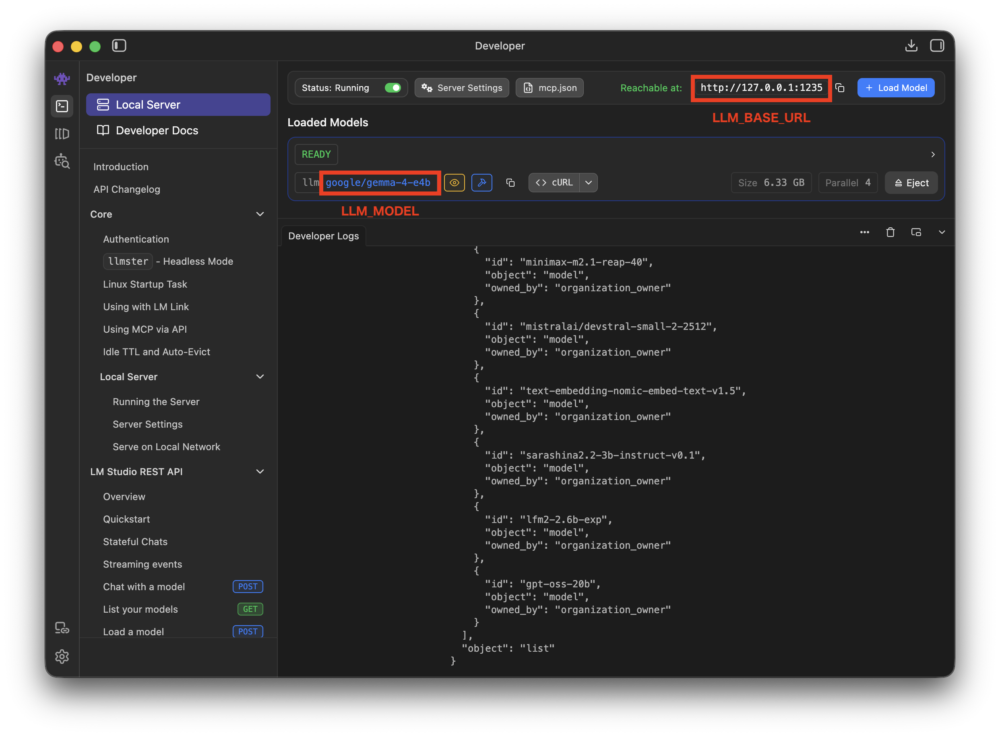

# Orb - RAG Chatbot for Obsidian Vaults

<p align="center">
  
</p>

A private RAG (Retrieval-Augmented Generation) chatbot for Obsidian vaults with multilingual support.

## License

This project is licensed under the MIT License - see the [LICENSE](LICENSE) file for details.

## Features

- **Private & Secure**: Run entirely locally or with your own API keys
- **RAG Architecture**: Retrieves relevant context from your vault before generating responses
- **Multiple LLM Backends**: Support for local models (Ollama, LM Studio) and cloud APIs (OpenAI)
- **Flexible Embedding**: Use local sentence-transformers or OpenAI embeddings
- **Web Interface**: Clean React-based chat interface
- **Citation Support**: See source documents for AI responses
- **Scope Filtering**: Search within specific folders or by tags
- **FastAPI Backend**: Modern, async API with comprehensive testing
- **Multilingual Support**: Automatic language detection for Japanese and English queries

## Documentation

- **[System Specification](.kiro/specs/)** - Complete technical specification and architecture (Kiro specs)
- **[Installation Guide](#installation)** - Quick start and setup instructions
- **[API Reference](#api-endpoints)** - Available API endpoints for web interface

## Architecture

The system follows a layered architecture:

1. **Ingestion Layer**: Reads and parses Obsidian vault files
2. **Embedding Layer**: Converts text to vector embeddings
3. **Indexing Layer**: Chunks documents and stores in ChromaDB
4. **Retrieval Layer**: Searches for relevant chunks
5. **Generation Layer**: Constructs prompts and generates responses
6. **API Layer**: FastAPI endpoints for web interface

## Quick Start

### Prerequisites

- Python 3.8+
- Obsidian vault with Markdown files
- Optional: Local LLM (Ollama/LM Studio) or OpenAI API key

### Installation

#### Option 1: Automated Installation (Recommended)

The simplest way to install Orb with the menu bar app:

```bash
git clone https://github.com/dxd5001/orb.git
cd orb
./install.sh
```

This script handles virtual environment creation, dependency installation, and configuration setup automatically.

#### Option 2: Manual Installation

```bash
git clone https://github.com/dxd5001/orb.git
cd orb
python -m venv venv
source venv/bin/activate  # On Windows: venv\Scripts\activate
pip install -e ".[menubar]"
cp .env.example .env
```

This installs the full backend (FastAPI, ChromaDB, embeddings, LLM support) plus the menu bar app dependencies (`pystray`, `Pillow`). The `orb` command will be available in your environment.

**Note**: Orb is currently not published on PyPI. Installation requires cloning the repository as shown above.

### Configuration

Copy `.env.example` to `.env` and edit it with your settings:

```bash
cp .env.example .env
```

```env
# Required
# Path to your Obsidian vault directory (the folder you opened in Obsidian)
# macOS default: /Users/yourname/Documents/Obsidian Vault
# Windows:       C:\Users\yourname\Documents\Obsidian Vault
# Linux:         /home/yourname/Documents/Obsidian Vault
VAULT_PATH=/path/to/your/obsidian/vault
VECTOR_STORE_PATH=./backend/chroma_db

# Local LLM (LM Studio/Ollama)
LLM_PROVIDER=local
LLM_MODEL=google/gemma-4-e4b
LLM_BASE_URL=http://127.0.0.1:1235

# Local Embeddings
EMBEDDING_PROVIDER=local
EMBEDDING_MODEL=paraphrase-multilingual-MiniLM-L12-v2

# Or OpenAI (uncomment and set API key)
# LLM_PROVIDER=openai
# LLM_MODEL=gpt-4o-mini
# EMBEDDING_PROVIDER=openai
# EMBEDDING_MODEL=text-embedding-3-small
# LLM_API_KEY=your_openai_api_key
# EMBEDDING_API_KEY=your_openai_api_key
```

<p align="center">
  
  <br/>
  <em>LM Studio running as a local API server</em>
</p>


### Running the Application

#### Option 1: Menu Bar Application (Recommended)

```bash
# Navigate to the directory where you cloned/installed orb
cd /path/to/orb

# Activate the virtual environment first
source venv/bin/activate  # On Windows: venv\Scripts\activate

# Then launch the menu bar app
orb

# Or directly without activating venv
./venv/bin/orb

# Or run the script directly
python menubar_app.py
```

The menu bar app provides:

- One-click start/stop of Web UI and MCP server
- Automatic browser opening
- Status monitoring
- System tray integration

> **Note**: The `orb` command is installed inside the virtual environment. You must either activate the venv (`source venv/bin/activate`) before running `orb`, or use the full path `./venv/bin/orb`. To avoid activating the venv every time, you can add an alias to your shell config (e.g. `~/.zshrc`):
> ```bash
> alias orb="/path/to/orb/venv/bin/orb"
> ```

#### Option 2: Web Server Only

```bash
cd backend
python main.py
```

Then open `http://localhost:8000`

#### Option 3: MCP Server Only

```bash
cd backend
python mcp_server.py
```

### First Time Setup

1. Start the application using one of the methods above
2. Click "Index Vault" to process your Obsidian files
3. Start chatting with your vault!

## Configuration

### Environment Variables

| Variable             | Description                          | Default                  |
| -------------------- | ------------------------------------ | ------------------------ |
| `VAULT_PATH`         | Path to Obsidian vault               | Required                 |
| `VECTOR_STORE_PATH`  | ChromaDB storage path                | `./backend/chroma_db`            |
| `API_PORT`           | Server port                          | `8000`                   |
| `LLM_PROVIDER`       | LLM backend (`local`/`openai`)       | `local`                  |
| `LLM_MODEL`          | LLM model name                       | `google/gemma-4-e4b`                 |
| `LLM_BASE_URL`       | Local LLM API URL                    | `http://127.0.0.1:1235` |
| `LLM_API_KEY`        | OpenAI API key                       | None                     |
| `EMBEDDING_PROVIDER` | Embedding backend (`local`/`openai`) | `local`                  |
| `EMBEDDING_MODEL`    | Embedding model name                 | `paraphrase-multilingual-MiniLM-L12-v2`       |
| `EMBEDDING_API_KEY`  | OpenAI embedding API key             | None                     |
| `USE_KEYRING`        | Store API keys in system keyring     | `false`                  |

### Local LLM Setup

#### LM Studio

1. Install LM Studio: https://lmstudio.ai/
2. Start a model server
3. Set `LLM_BASE_URL` to your server URL in `.env`

#### Ollama

1. Install Ollama: https://ollama.ai/
2. Pull a model: `ollama pull llama2`
3. Set `LLM_BASE_URL=http://localhost:11434` in `.env`

### OpenAI Setup

1. Get API key from https://platform.openai.com/
2. Set `LLM_PROVIDER=openai` and `LLM_API_KEY` in `.env`
3. Optionally set `EMBEDDING_PROVIDER=openai` for OpenAI embeddings

## Multilingual Support

The chatbot automatically detects and responds in the user's language:

### Supported Languages

- **Japanese**: Automatically detected from hiragana, katakana, and kanji characters
- **English**: Default language for all other inputs

### Usage Examples

```bash
# Japanese query
curl -X POST "http://localhost:8000/api/chat" \
  -H "Content-Type: application/json" \
  -d '{"query": "4/10にやっていたこと"}'

# English query
curl -X POST "http://localhost:8000/api/chat" \
  -H "Content-Type: application/json" \
  -d '{"query": "What did I do on April 10th?"}'
```

The system automatically selects the appropriate language prompt and generates responses in the detected language.

## API Endpoints

### Chat

```http
POST /api/chat
Content-Type: application/json

{
  "query": "What are my thoughts on machine learning?",
  "scope": {
    "folder": "machine-learning/",
    "tags": ["ml", "ai"]
  },
  "history": [
    {"role": "user", "content": "Previous question"},
    {"role": "assistant", "content": "Previous answer"}
  ]
}
```

### Index Vault

```http
POST /api/index
```

### Get Status

```http
GET /api/status
```

### Configuration

```http
GET /api/config
PUT /api/config
```

## Development

### Project Structure

```
orb/
|-- backend/
|   |-- ingestion/          # Vault file reading
|   |-- embedding/          # Text embedding
|   |-- indexing/           # Vector storage
|   |-- retrieval/          # Similarity search
|   |-- generation/         # Response generation
|   |-- llm/               # LLM backends
|   |-- routers/           # API endpoints
|   |-- utils/             # Utility functions
|   |-- tests/             # Test suite
|   |-- config.py          # Configuration management
|   |-- models.py          # Data models
|   |-- main.py            # Application entry
|   |-- mcp_server.py      # MCP server implementation
|   |-- requirements.txt   # Dependencies
|   |-- chroma_db/         # Vector database storage (runtime)
|-- frontend/
|   |-- components/        # React components
|   |-- styles/            # CSS styles
|   |-- utils/             # Frontend utilities
|   |-- index.html         # Web interface
|-- docs/                  # Documentation assets
|-- tests/                 # Integration tests
|-- .env.example          # Environment template
|-- DEVELOPMENT.md         # Development guide
|-- LICENSE                # License file
|-- install.sh             # Installation script
|-- menubar_app.py         # Menubar application
|-- orb_cli.py             # CLI interface
|-- pyproject.toml         # Python project configuration
|-- setup.py               # Package setup
|-- README.md              # This file
```

### Running Tests

```bash
cd backend
python -m pytest tests/ -v
```

### Code Quality

- Comprehensive test coverage with pytest
- Property-based testing with hypothesis
- Type hints throughout
- Comprehensive logging
- Error handling and validation

## Security Considerations

- **Local Mode**: All processing happens locally, no data leaves your machine
- **Cloud Mode**: Vault content is sent to external APIs (OpenAI)
- **API Keys**: Store securely using environment variables or system keyring
- **Network**: Default binds to localhost only

## Troubleshooting

### Common Issues

1. **`orb` command not found**
   - Solution: Activate the virtual environment first: `source venv/bin/activate`
   - Or use the full path: `./venv/bin/orb`
   - Or add an alias to `~/.zshrc`: `alias orb="/path/to/orb/venv/bin/orb"`

2. **"Collection not found" error**
   - Solution: Click "Index Vault" first to process your files

3. **"Invalid vault path" error**
   - Solution: Check that `VAULT_PATH` in `.env` points to a valid Obsidian vault

4. **LLM connection errors**
   - For local: Ensure Ollama/LM Studio is running on the correct port
   - For OpenAI: Check your API key and network connection

5. **Memory errors with large vaults**
   - Solution: Increase system RAM or use smaller embedding models

### Debug Mode

Enable debug logging:

```bash
export PYTHONPATH=/path/to/backend
python -m logging.basicConfig(level=logging.DEBUG)
python backend/main.py
```

## Performance Tips

1. **Embedding Models**: Use smaller models (`all-MiniLM-L6-v2`) for faster indexing
2. **Chunk Size**: Adjust `CHUNK_SIZE` in `indexing/indexer.py` for your content
3. **Local LLMs**: Use quantized models for better performance
4. **Vector Store**: Store on SSD for faster retrieval

## Contributing

1. Fork the repository
2. Create a feature branch
3. Add tests for new functionality
4. Ensure all tests pass
5. Submit a pull request

## License

This project is licensed under the MIT License - see the LICENSE file for details.

## Acknowledgments

- Obsidian for the excellent note-taking platform
- ChromaDB for vector storage
- FastAPI for the web framework
- React for the frontend interface
- sentence-transformers for embeddings
- OpenAI for API access
